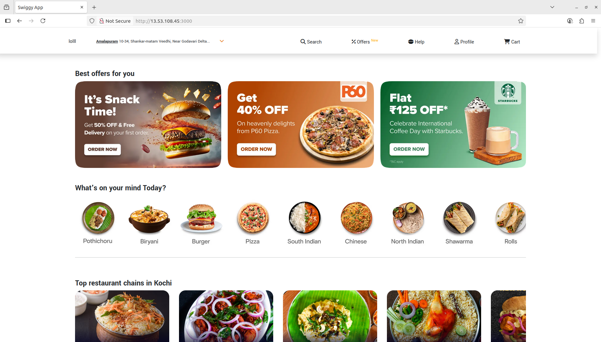

# DevOps Real-time Project: Swiggy Clone App Deployment
 
### Phase 1: Initial Setup and Deployment

**step 1: Launch EC2 instance (ubuntu 22.04)**

- provision an EC2 instance on AWS with ubuntu 22.04
- connect the instance using ssh

**step 2:clone the repository**

- update all the packages and clone the code

```bash
git clone https://github.com/didin8080/swiggy-project.git
```

**step 3: Install docker**

```bash
sudo apt-get update
sudo apt-get install docker.io -y
sudo usermod -aG docker ubuntu  
newgrp docker
sudo chmod 777 /var/run/docker.sock
```

### **Phase 2:For security**

**step 1:Install sonarqube and trivy**

- SonarQube

```bash
docker run -d --name sonar -p 9000:9000 sonarqube:lts-community
```

- Trivy

```bash
sudo apt-get install wget apt-transport-https gnupg lsb-release -y
wget -qO - https://aquasecurity.github.io/trivy-repo/deb/public.key | gpg --dearmor | sudo tee /usr/share/keyrings/trivy.gpg > /dev/null
echo "deb [signed-by=/usr/share/keyrings/trivy.gpg] https://aquasecurity.github.io/trivy-repo/deb $(lsb_release -sc) main" | sudo tee -a /etc/apt/sources.list.d/trivy.list
sudo apt-get update
sudo apt-get install trivy -y
```

**step 2:Integrate Sonarqube and configure**

- Integrate SonarQube with your CI/CD pipeline.
- Configure SonarQube to analyze code for quality and security issues.


### **Phase 3: setup CI/CD Pipeline**

**step 1:Install Jenkins**

```bash
sudo apt update -y
wget -O - https://packages.adoptium.net/artifactory/api/gpg/key/public | tee /etc/apt/keyrings/adoptium.asc
echo "deb [signed-by=/etc/apt/keyrings/adoptium.asc] https://packages.adoptium.net/artifactory/deb $(awk -F= '/^VERSION_CODENAME/{print$2}' /etc/os-release) main" | tee /etc/apt/sources.list.d/adoptium.list
sudo apt update -y
sudo apt install temurin-17-jdk -y
/usr/bin/java --version
curl -fsSL https://pkg.jenkins.io/debian-stable/jenkins.io-2023.key | sudo tee /usr/share/keyrings/jenkins-keyring.asc > /dev/null
echo deb [signed-by=/usr/share/keyrings/jenkins-keyring.asc] https://pkg.jenkins.io/debian-stable binary/ | sudo tee /etc/apt/sources.list.d/jenkins.list > /dev/null
sudo apt-get update -y
sudo apt-get install jenkins -y
sudo systemctl start jenkins
sudo systemctl status jenkins
```
- Access Jenkins in a web browser using the public IP of your EC2 instance.
        
        publicIp:8080

**step 2: Install Necessary plugins in jenkins.**

Goto Manage jenkins  --> Plugins --> Available Plugins

Install below plugins

- Eclipse Temurin Installer (Install without restart)

- SonarQube Scanner (Install without restart)

- NodeJs Plugin (Install Without restart)

- OWASP Dependency-Check

- Pipeline: Stage view

- Docker

- Docker commons

- Docker API

- Docker-build-step

- Docker Pipeline

Restart jenkins when no jobs are running.

### **Configure Java and Nodejs in Global Tool Configuration**

Goto Manage Jenkins → Tools → 
- Install JDK(17) → enable install automatically → add installer → Import from adoptium.net → version jdk17.0.11+9
- Sonarqube scanner installations → add sonarqube → give name (sonar-scanner) 
- Nodejs installation → add Nodejs → give name (node23) 
- Dependency-Check installation → add dependency check → give name → (DP-Check) → enable install automatically → add installer → install from github.com
- Docker installation → add docker → give name (docker) → enable install automatically → add installer → Download from dockerhub 

### SonarQube
- create token 
    Goto sonarqube → administration → security → user → token 3dots → give name (token) → generate → copy the token 

### Add credentials on jenkins

Goto Jenkins Dashboard → Manage Jenkins → Credentials → global → Add Secret Text → paste the token → give name (sonar-token) → add credentials


Add Credentials → Add username and password → provide username and password of docker hub → give name (docker) → add it

### Create webhook on sonarqube

Goto sonarqube → Administration → configuration → webhook → create → give name (jenkins) → paste the jenkins ip with port number and with /sonarqube-webhook  eg:(192.168.20.173:8080/sonarqube-webhook) → save it

### Configure Sonarqube on jenkins

Goto jenkins dashboard → Manage jenkins → add sonarqube → give name (sonar-scanner) → paste the sonarqube ip with portnumber → add sonarqube credentals (sonar-token) → apply and save

 ### On terminal 

 Login into docker hub using

 ```bash
 docker login -u <username of docker>
 ```
  it ask for a password provide password of dockerhub

## Configure CI/CD Pipeline in jenkins

- Goto Jenkins Dashboard → new item → give any name (swiggy app) → select pipeline → OK

```groovy
pipeline {
    agent any
    tools {
        jdk 'jdk17'
        nodejs 'node24'
    }
    environment {
        SCANNER_HOME = tool 'sonar-scanner'
    }
    options {
        timestamps() // Enable timestamped logs
    }
    stages {
        stage('Clean Workspace') {
            steps {
                cleanWs()
            }
        }

        stage('Checkout from Git') {
            steps {
                git 'https://github.com/didin8080/swiggy-project.git'
            }
        }

        stage('SonarQube Analysis') {
            steps {
                withSonarQubeEnv('sonar-server') {
                    sh ''' 
                        $SCANNER_HOME/bin/sonar-scanner \
                        -Dsonar.projectKey=swiggy \
                        -Dsonar.projectName=swiggy \
                        -Dsonar.sources=. \
                        -Dsonar.exclusions=node_modules/**,dist/**,build/**,test/** \
                        -Dsonar.sourceEncoding=UTF-8
                    '''
                }
            }
        }

        stage('Quality Gate') {
            steps {
                script {
                    try {
                        timeout(time: 5, unit: 'MINUTES') {
                            waitForQualityGate abortPipeline: false, credentialsId: 'sonar-token'
                        }
                    } catch (e) {
                        echo "⚠️ Quality Gate timed out or failed to return in time. Continuing pipeline. Reason: ${e.getMessage()}"
                        // Optionally mark as unstable or send notification here
                    }
                }
            }
        }

        stage('Install Dependencies') {
            steps {
                sh 'npm install'
            }
        }

        stage('Security Scans (Parallel)') {
            parallel {
                stage('OWASP FS Scan') {
                    steps {
                        dependencyCheck additionalArguments: '--scan ./ --disableYarnAudit --disableNodeAudit', odcInstallation: 'DP-Check'
                        dependencyCheckPublisher pattern: '**/dependency-check-report.xml'
                    }
                }
                stage('Trivy FS Scan') {
                    steps {
                        sh 'trivy fs . > trivyfs.txt'
                    }
                }
            }
        }

        stage('Docker Build & Push') {
            steps {
                script {
                    withDockerRegistry(credentialsId: 'docker', toolName: 'docker') {
                        sh 'docker build -t swiggy .'
                        sh 'docker tag swiggy didin8080/swiggy:latest'
                        sh 'docker push didin8080/swiggy:latest'
                    }
                }
            }
        }

        stage('Trivy Image Scan') {
            steps {
                sh 'trivy image didin8080/swiggy:latest > trivy.txt'
            }
        }

        stage('Deploy to Container') {
            steps {
                sh 'docker run -d --name swiggy -p 3000:3000 didin8080/swiggy:latest'
            }
        }
    }
}
```
### **Replace the checout repo and generate the link using Pipeline Syntax**

Goto jenkins dashboard → select pipeline → scrolldown select pipeline Syntax → on sample step → select git:Git → paste the repo url → verify the branch → generate pipeline script → copy the link and paste it on checkout

**Build it**

**verify it**

```bash
docker image ls

docker ps 
```

### To Check weather it is deployed or not 

`(localhost:3000)`

paste it on the new tab 

<div align="center">

<p align="center">Home Page </p>
